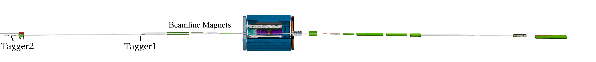

Hackathon problems
===

Low-Q2
---

In this problem you will develop a method to carry out the transportation of a track measured in the Low-Q2 Tagger, through the beamline magnetic optics to reconstruct the electron momentum at the interaction point.



### Data
In order to carry out supervised training you will need files with Feature and Target tensors output from EICrecon. The feature collection contains the parameters of tracks which have been constructed from a fit to 4 points and projected back onto a common plane. The figure below shows two examples of these tracks.

<div style="text-align:center">

</div>

TaggerTrackerFeatureTensor:
1. y position on plane [mm]
2. z position on plane [mm]
3. x component of unit vector
4. y component of unit vector

The target is the three momentum of the electron, scaled such that the beam momentum=1.

TaggerTrackerTargetTensor
1. x component of normalised momentum 
2. y component of normalised momentum 
3. z component of normalised momentum

Files containing these two collections to carry out supervised learning can be downloaded (or streamed) from the JLab xrootd servers. These can be opened in root using:

```
 root "root://dtn-eic.jlab.org//volatile/eic/EPIC/xrdtest/Hackathon-2025/1.LOWQ2/training/tensors_3.eicrecon.tree.edm4eic.root"
```

These can be copied locally using:

```
xrdcp "root://dtn-eic.jlab.org//volatile/eic/EPIC/xrdtest/Hackathon-2025/1.LOWQ2/training/tensors_3.eicrecon.tree.edm4eic.root" ./
```

Or the path can directly be passed to a training script.

There are files avaliable in the directory from ```tensors_3``` to ```tensors_19```. Where ```tensors_3``` is 32MB and the others are 8MB.

### Challenge

Create a trained onnx file which carries out the regression transformation. This can be done however you see fit, basic pytorch libraries are avaliable on the eic_shell but other environments are avaliable.

A demonstration script using pytorch to read an convert a dataset, train a basic network and write out an onnx network is available here:

xxx

And can be run using e.g.

```
python ExampleRegression.py \
        --dataFiles "root://dtn-eic.jlab.org//volatile/eic/EPIC/xrdtest/Hackathon-2025/1.LOWQ2/training/tensors_3.eicrecon.tree.edm4eic.root" \
        --outModelFile "test.onnx"
```

You are recommended to only copy parts of this as necessary and otherwise develope your own solutions. You are also encoraged to collaborate with other participants and Copilot/ChatGPT (other LLMs are avaliable) 


### Submission and scoring of solution

The EICrecon main branch available in eic-shell is already able to output a file containing the tensors required to submit. You will need to run EICRecon on the sample data file, outputting a file named ```submit_lowq2.edm4hep.root``` containing only the ```TaggerTrackerPredictionTensor``` collection and passing your onnx file path via the command line argument.

A relatively minimal version of EICrecon can be run with this:

```
eicrecon "root://dtn-eic.jlab.org//volatile/eic/EPIC/xrdtest/Hackathon-2025/1.LOWQ2/testing/features_lowq2.edm4eic.root" \
        -Ppodio:output_file=submit_lowq2.edm4eic.root \
        -Ppodio:output_collections=TaggerTrackerPredictionTensor \
        -PLOWQ2:TaggerTrackerTransportationInference:modelPath=xxx.onnx \
        -Pplugins_to_ignore=janatop,LUMISPECCAL,ECTOF,BTOF,FOFFMTRK,RPOTS,B0TRK,MPGD,ECTRK,DRICH,DIRC,pid,tracking,acts,EEMC,BEMC,FEMC,EHCAL,BHCAL,FHCAL,B0ECAL,ZDC,BTRK,BVTX,PFRICH,richgeo,evaluator,pid_lut,reco,rootfile
```

Where you should replace the `xxx.onnx` with your trained model.

Upload the file via the website as advised in the introduction.

Your submitted solution will be scored against a hidden dataset using the script:

[https://github.com/eic/epic-hackathon-2025/blob/master/1.LOWQ2/low-q2_scoring.py](https://github.com/eic/epic-hackathon-2025/blob/master/1.LOWQ2/low-q2_scoring.py)

An alternative script which carries out an identical inference as EICrecon and scoring calculation is avaliable for testing here, this can be used for faster evaluation of your onnx file.

[https://github.com/eic/epic-hackathon-2025/blob/master/1.LOWQ2/TestModel.py
](https://github.com/eic/epic-hackathon-2025/blob/master/1.LOWQ2/TestModel.py)

requiring:

[https://github.com/eic/epic-hackathon-2025/blob/master/1.LOWQ2/ProcessData.py](https://github.com/eic/epic-hackathon-2025/blob/master/1.LOWQ2/ProcessData.py)

The script calculates the root mean square difference between the Target and Prediction tensors, the x and y components have been scaled by 100 so the smaller values have a similar contribution. 3 subsets of the data are scored:
1. Full dataset
2. z component of normalized momentum less than 0.7
3. polar angle of momentum greater than 2 mrad

The overall score for the challenge is given by:

```
1.0 - (np.exp(score_sum) - 1.0) / (np.exp(1.0) - 1.0)
```

Where 1 is the maximum score.

**Please keep your onnx file, training and model scripts so we can reach out, further testing and potentially deploying any which perform better than the current default solution!**

### Things to consider
* The training sample uses the Q2=0-1GeV Pythia6 eic events so the distribution of electron energies and polar angle in the sample is not uniform. The reconstruction needs to perform well for all kinematics not just those with the highest statistics. 
* Some events will contain no tracks and others may contain more than a single potential track if more than 4 hits are present and meet a chi2 criteria. The data can be simply filtered by the first component of the shape of the tensor, limiting this to 1.
* Preprocess and/or post-processing the data to reduce the amount a network needs to learn. Values around the range -1 to 1 are usually where the NN functions have the most sensitivity.


DIRC
---


In this problem you will do Particle Identification with a DIRC (Detection of Internally Reflected Cherenkov light). In this detector light is being produced in radiation bars, undergoes multitude of internal reflections and ends up being projected onto a sensor plane.

Current configuration uses 12 sectors, each having a 80x116 sensor array. For this hackathon particles of interest are pointing at $\varphi=0$ and $\theta \in [45^\circ, 135^\circ]$ towards a specific sector.

### Code organization

You will need to use a custom branch of EICrecon: https://github.com/eic/EICrecon/tree/dirc_2025. The following is a description of the implementation.

Machine learning will utilize input from the DIRC itself as well as the identified tracks themselves. It makes sense to organize input features into two tensors: one for the DIRC pixel array and one for the list of track properties (They are produced in [src/algorithms/onnx/DIRCParticleIDPreML.cc](https://github.com/eic/EICrecon/blob/dirc_2025/src/algorithms/onnx/DIRCParticleIDPreML.cc)). Additionally, we export targets (for training only) in the form of a one-hot tuple: `(1, 0)` if track corresponded to a pion and `(0, 1)` if track corresponded to a kaon. Such encoding allows to add additional classes like electrons and protons, if needed. A common inference factory loads a model from `calibrations/onnx/DIRCBarrel.onnx`, feeds feature tensors to it and receives a probability tensor. Finally, algorithm from [src/algorithms/onnx/DIRCParticleIDPostML.cc](https://github.com/eic/EICrecon/blob/dirc_2025/src/algorithms/onnx/DIRCParticleIDPostML.cc) combines original particles with newly obtained probabilities to get new particle objects with PID information added. The following wiring is implemented in [src/detectors/DIRC/DIRC.cc](https://github.com/eic/EICrecon/blob/dirc_2025/src/detectors/DIRC/DIRC.cc): 


### Workflow

#### Obtain example code

```
git clone https://github.com/eic/epic-hackathon-2025
cd epic-hackathon-2025/2.DIRC/
```

#### Environment

You are expected to work in eic-shell environment. We are looking to use specifically version 24.12.0 of the container. It can be installed using:

```
curl -L https://github.com/eic/eic-shell/raw/main/install.sh | bash -s -- -v 24.12.0-stable
```

Before doing any of the following steps, you need to enter into the shell:
```
./eic-shell
```

#### Obtaining input files

This will show the input files that are prepared for you:
```
xrdfs root://dtn-eic.jlab.org/ ls /volatile/eic/EPIC/xrdtest/Hackathon-2025/2.DIRC/
```

There are three types of files per dataset:
 - dirc_XGeV_YGeV.eicrecon.edm4eic.root (for training)
 - dirc_XGeV_YGeV_eval.eicrecon.edm4eic.root (same but smaller, for evaluation)
 - dirc_XGeV_YGeV_submit.eicrecon.edm4eic.root (blinded, for submitting)

Here dirc_$X$GeV_$Y$GeV is a simulation particles (pions and kaons, randomly) of random charge sign with random momenta in range from $X$ GeV to $Y$ GeV are thrown at DIRC at $\varphi = 0$.

For your convenience, the simulation files are provided with the following EDM4eic collections pre-reconstructed:
 - DIRCRawHits
 - MCParticles
 - CentralCKFTracks
 - ReconstructedChargedWithoutPIDParticles
 - ReconstructedChargedWithoutPIDParticleAssociations

As you may have noticed, those are exactly the inputs of the processes shown on the diagram above.

#### Building EICrecon

Use the build script provided:
```bash
./build_eicrecon.sh
```

#### Running EICrecon (partially)

The `run_eicrecon.sh` script is provided. It is a simple wrapper designed to make sure that the built EICrecon is used instead of EICrecon from the container. It also automatically adjusts the output name and defines `-Ppodio:output_collections` with a list of collections that we want to obtain.

Let's do the preprocessing:

```
./run_eicrecon.sh root://dtn-eic.jlab.org//volatile/eic/EPIC/xrdtest/Hackathon-2025/2.DIRC/dirc_1GeV_1GeV.eicrecon.edm4eic.root -PDIRC:DIRCBarrelParticleIDPostML:LogLevel=off -PDIRC:DIRCBarrelParticleIDInference:LogLevel=off
```
This will produce `dirc_1GeV_1GeV.hackathon.edm4eic.root` (note difference `.eicrecon.` vs `.hackathon.`, latter contains tensor outputs).

The reason to disable logging for certain factories is because they won't work just yet. If we don't, they will produce error messages printed in the output:
```
[DIRC:DIRCBarrelParticleIDInference] [error] ONNX error Load model from calibrations/onnx/DIRCBarrel.onnx failed:Load model calibrations/onnx/DIRCBarrel.onnx failed. File doesn't exist
```

Our goal is to be able to run inference within EICrecon. For that we will need the ML model file `calibrations/onnx/DIRCBarrel.onnx`, but it doesn't exist yet. What EICrecon did for us, is it succesfully executed `DIRCParticleIDPreML` and wrote input tensors to the output, but the `DIRCBarrelParticleIDInference` and anything after that can not execute until we provide a model.

We will need to also preprocess eval file:
```bash
./run_eicrecon.sh root://dtn-eic.jlab.org//volatile/eic/EPIC/xrdtest/Hackathon-2025/2.DIRC/dirc_1GeV_1GeV_eval.eicrecon.edm4eic.root -PDIRC:DIRCBarrelParticleIDPostML:LogLevel=off -PDIRC:DIRCBarrelParticleIDInference:LogLevel=off
```

### Training

The `learn.py` script contains an example implementation of training using Torch.

You can run it over tensor files for 1GeV particle sample:
```bash
./learn.py --train dirc_1GeV_1GeV.hackathon.edm4eic.root --eval dirc_1GeV_1GeV_eval.hackathon.edm4eic.root
```
(Press Ctrl-C when you get tired of it slowly training...)

You should get a $\sim 66\%$ accuracy from the first epoch. It will also produce bunch of files like `model_weights_epoch_0000.pth`.

An ultimate goal for you is to adjust the network to improve the performance (look at implementation of `NeuralNetwork`) and type of training (default instance of `torch.optim.Adam` is used for `optimizer`). For that you will need to modify `learn.py`. Feel free to submit a result produced as-is to the leaderboard. If you can get through all the steps, that means you've learned something!

The final step after training is to convert your model from Torch .pth format to ONNX format. The `conv.py` script. Use it like so:
```
./conv.py model_weights_epoch_0010.pth
```
(Make sure to update 0010 to the best available epoch)
It will create `calibrations/onnx/DIRCBarrel.onnx`, which is exactly the file that EICrecon would expect.

### Running EICrecon (with ML inference)

Now that the `calibrations/onnx/DIRCBarrel.onnx` is present we can run the full set of algorithms: `DIRCBarrelParticleIDPreML`, `DIRCBarrelParticleIDInference` and `DIRCBarrelParticleIDPostML`.
```
./run_eicrecon.sh root://dtn-eic.jlab.org//volatile/eic/EPIC/xrdtest/Hackathon-2025/2.DIRC/dirc_1GeV_1GeV_submit.eicrecon.edm4eic.root
```

The resulting `dirc_1GeV_6GeV_submit.hackathon.edm4eic.root` is to be uploaded to be scored on the leaderboard. Good luck!

### Optional exercises
 - Take your trained model (`calibrations/onnx/DIRCBarrel.onnx`) and upload it to https://netron.app. What do you see? Can you explain how this relates to the model implementation in Python (learn.py)?
 - The current model takes 3 inputs (track momentum, track theta, track phi). Can you add the track charge by modifying `DIRCParticleIDPreML`?
 - The transformation implemented in `DIRCParticleIDPreML` converts list of DIRC hits to a tensor containing a 2D pixel map. This may not be the most optimal encoding. Try implementing a tensor that contains a list of pixel coordinates. For simplicity, it can have a reserved length for, say, up to 50 fired pixels, and abscent pixels can be encoded as `x=y=0`.
